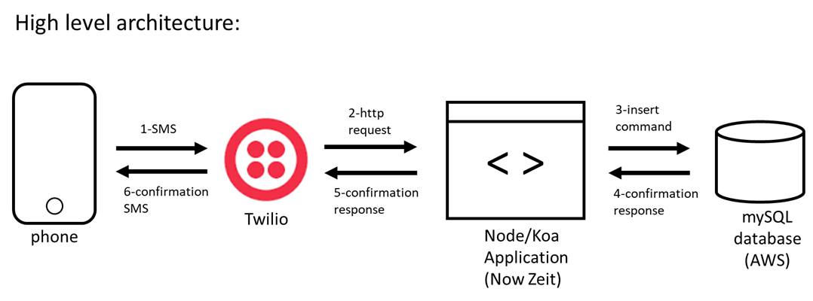

# WMDD4935 - Assignment 2
## Texting to-do items into a database



### Twilio phone number to text to: 
`(778) 644-0737`

### Node Application Endpoint: 
`https://twilio-post-mysql.marciaisejima.now.sh`

### Instructions:
#### To insert to do items:
Text the to-do item to the Twilio number provided.
If successful, you will receive a message as follows: 

```
Sent from your Twilio trial account - Todo item inserted successfully!
```
